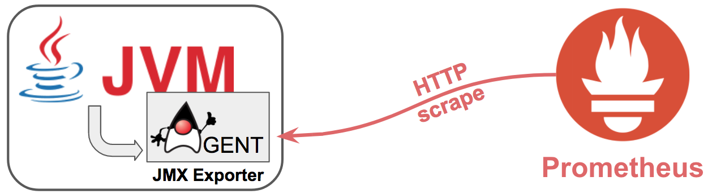

# Easy Kafka applications metrics to Prometheus
In order to have metrics on your Kafka applications (producers, consumers, streams), the java clients provide metrics through Mbeans.

To be able to have those metrics scraped by Prometheus for monitoring, Prometheus created a project called [JMX exporter](https://github.com/prometheus/jmx_exporter).

This project provides some JMX exporter configuration files to parse the Mbeans from Kafka producers, consumers & streams applications.

It also provides a template of Grafana dashboard based on Prometheus to monitor those applications.

The following image summarizes how this is working


## How to use it
### Use the jmx_exporter
Simply submit your Kafka application with JMX activated and with the jar from jmx_exporter as a java agent.

For instance:

```bash
java -Dcom.sun.management.jmxremote.rmi.port=${JMX_PORT} \
-Dcom.sun.management.jmxremote.port=${JMX_PORT} \
-Dcom.sun.management.jmxremote.ssl=false \
-Dcom.sun.management.jmxremote.authenticate=false \
-javaagent:${JMX_EXPORTER_JAR}=${JMX_EXPORTER_PORT}:${JMX_EXPORTER_CONF_FILE_PATH} \
-jar ${MY_JAVA_APP}
```

### Set up the Grafana dashboard
Create a new dashboard by importing the JSON template in the folder grafana.

Then just select the `pod_container_name` variable corresponding to your application and you're up!

NB: to get the `pod_container_name` we decided to add a label source="kafka" to our kubernetes deployments. You may have to change the way you get those according to your needs.

